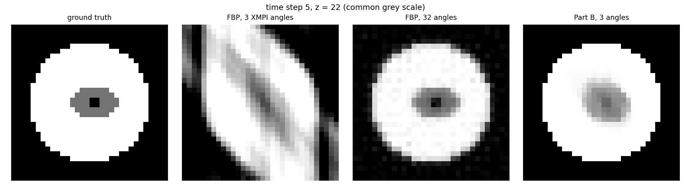
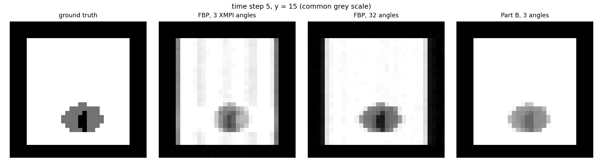
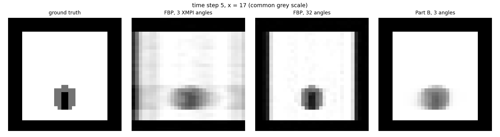
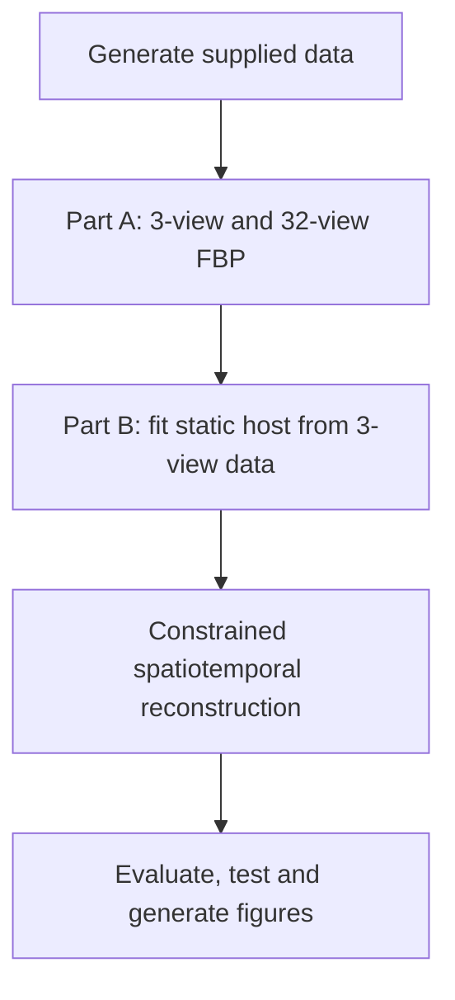

# Physics-constrained 4D XMPI reconstruction from three projections

Technical exercise submission for the Lund University postdoctoral project on fast time-resolved 3D X-ray multi-projection imaging (XMPI) for advanced manufacturing.

**Candidate:** Dr. Muhammad Adnan Aslam<br>
**Exercise time:** Approximately 6 hours 30 minutes<br>
**Implementation:** Python, NumPy, SciPy, scikit-image and Matplotlib<br>
**Compute requirement:** CPU-only; the complete example runs on a laptop

## Executive summary

This repository reconstructs a sequence of ten 3D attenuation volumes from sparse X-ray measurements. Each volume contains `32 x 32 x 32` voxels. The XMPI acquisition provides only three simultaneous fixed-angle projections at `0°`, `30°` and `48°`; the conventional reference contains 32 views distributed over 180°.

Two reconstruction stages are implemented:

| Stage | Input | Method | Output |
|---|---|---|---|
| Part A | 3-view XMPI and 32-view reference | Slice-wise filtered back-projection (FBP) | `recon_fbp_xmpi.npz`, `recon_fbp_full.npz` |
| Part B | **Only the 3-view XMPI data** | Static-host decomposition with physical constraints, 3D TV, sparsity and temporal coupling | `recon_advanced.npz` |

The supplied evaluator gives the following mean scores over all ten time steps:

| Reconstruction | Views | NCC | PSNR | SSIM |
|---|---:|---:|---:|---:|
| FBP with Hann filter | 3 | 0.676 | 6.46 dB | 0.348 |
| FBP with ramp filter | 32 | 0.990 | 23.34 dB | 0.883 |
| Physics-constrained Part B | 3 | **0.999** | **35.53 dB** | **0.983** |

The Part B result substantially improves on three-view FBP. The headline scores must nevertheless be interpreted carefully: the accurately fitted static cylinder occupies most voxels and therefore dominates whole-volume metrics. The moving melt-pool envelope is recovered only coarsely, and the narrow keyhole is not reliably resolved.

## Reconstruction results

All panels below use the same grey scale. Each row compares, from left to right, the held-out ground truth, three-angle FBP, 32-angle FBP, and the proposed three-angle Part B reconstruction.

### Axial plane: time step 5, `z = 22`



The three-view FBP contains severe diagonal bright/dark streaks and a distorted sample boundary. Part B restores the cylindrical support and localizes the reduced-attenuation region, although its boundary is smoother and less sharply separated than in the ground truth.

### Coronal plane: time step 5, `y = 15`



The coronal view shows that the damage from missing angles is direction-dependent. Part B suppresses the long vertical ghosts seen in sparse-view FBP and recovers the approximate melt-pool height, but it merges the narrow keyhole with the broader reduced-attenuation region.

### Sagittal plane: time step 5, `x = 17`



The sagittal comparison confirms that the static support is stable and the dynamic region is localized. Fine interface curvature and keyhole width remain unsupported by the three-view measurements.

## Problem and data

The dataset is generated by the supplied forward model. Projections are Radon transforms with Poisson photon noise added in the intensity domain.

| Property | Value |
|---|---|
| Time steps | 10 |
| Volume per time step | `32 x 32 x 32` voxels |
| Detector bins per slice | 46 |
| XMPI angles | `0°`, `30°`, `48°` |
| Conventional reference | 32 angles over 180° |
| XMPI sinogram shape | `(10, 32, 46, 3)` |
| 32-view sinogram shape | `(10, 32, 46, 32)` |
| Reconstruction array shape | `(10, 32, 32, 32)` |

The approximate parallel-beam angular sampling guideline is

$$
N_\theta \approx \frac{\pi D}{2}.
$$

For an object width of `D = 32` pixels, this suggests roughly 50 projection angles. Three views provide only about 6% of that count and cover a 48° sector, leaving 132° of the 180° angular range unobserved. The resulting inverse problem is severely underdetermined and has a large direction-dependent null space.

## Reconstruction workflow



### Part A: filtered back-projection baselines

`part_A_fbp_TASK.py` applies `skimage.transform.iradon` independently to every `(time, z)` sinogram with:

- `output_size=32`;
- `circle=False`, matching the supplied forward projector;
- a Hann filter for the three-view reconstruction, which reduces high-frequency streak amplification;
- a ramp filter for the 32-view reference, which preserves detail when the angular range is well covered.

The three-view FBP result is intentionally not clipped. Its negative and positive streaks are genuine evidence of sparse-angle failure and should not be hidden by post-processing.

### Part B: physics-constrained spatiotemporal reconstruction

`part_B_advanced_TASK.py` uses only `data/xmpi_projections.npz`. It does not read `ground_truth.npz`, the 32-view data, `phantom.py`, or the evaluator during reconstruction.

The model decomposes each time-dependent volume into

$$
x_t = b + d_t,
$$

where `b` is a static cylindrical host estimated from the three-view measurements and `d_t` is a non-positive dynamic contrast representing lower attenuation in the melt-pool/keyhole region.

The practical FISTA-style splitting scheme approximately minimizes

$$
\frac{1}{2}\lVert A d-(p-A b)\rVert_2^2
+ \lambda_s\,\mathrm{TV}_{3D}(d)
+ \lambda_1\lVert d\rVert_1
+ \frac{\lambda_t}{2}\sum_t\lVert d_{t+1}-d_t\rVert_2^2,
\qquad -b \leq d \leq 0.
$$

Here:

- `A` is an exact discrete Radon system matrix built from unit-impulse projections;
- `p` is the measured three-view sinogram;
- the data-fidelity term enforces projection consistency;
- 3D total variation favors compact piecewise-constant structure;
- one-sided sparsity suppresses isolated angular ghosts;
- temporal coupling shares information between adjacent frames;
- `-b <= d <= 0` enforces non-negative attenuation and the fitted material bound.

TV denoising, one-sided shrinkage and box projection are applied sequentially. This is a practical splitting approximation, not an exact proximal map for the complete nonsmooth objective.

### Data-only parameter selection

The Part B parameters are tied to projection-domain noise and diagnostics rather than held-out truth.

| Quantity | Value |
|---|---:|
| Robust air-ray noise estimate, `sigma` | `2.3186e-3` |
| 3D TV weight, `4 sigma` | `9.2746e-3` |
| Sparsity weight, `0.2 sigma` | `4.6373e-4` |
| Temporal weight | `0.25` |
| Step size | `9.4508e-3` |
| Maximum/completed iterations | `80 / 80` |
| Final relative change | `1.6403e-3` |
| Final projection RMSE | `2.9136e-3` |
| Static-host fit RMSE | `3.1092e-4` |

The final projection RMSE is close to the measured log-intensity noise scale. This discrepancy-based comparison was used to avoid fitting projection noise excessively.

## Reproduce everything

### 1. Clone the repository

```bash
git clone https://github.com/malikmadnanaslam/xmpi-sparse-angle-reconstruction.git
cd xmpi-sparse-angle-reconstruction
```

### 2. Create and activate a virtual environment

Python 3.10 or newer is recommended.

Windows PowerShell:

```powershell
python -m venv .venv
.\.venv\Scripts\Activate.ps1
```

Windows Command Prompt:

```bat
python -m venv .venv
.venv\Scripts\activate.bat
```

Linux/macOS:

```bash
python3 -m venv .venv
source .venv/bin/activate
```

### 3. Install the pinned dependencies

```bash
python -m pip install --upgrade pip
python -m pip install -r requirements.txt
```

Pinned packages are listed in `requirements.txt`:

```text
numpy==2.5.2
scipy==1.18.0
scikit-image==0.26.0
matplotlib==3.10.8
```

### 4. Generate the supplied synthetic data

```bash
python generate_dataset.py
```

This creates:

| File | Contents and allowed use |
|---|---|
| `data/xmpi_projections.npz` | Three fixed-angle XMPI measurements; used in Parts A and B |
| `data/full_projections.npz` | 32-angle conventional reference; used only in Part A |
| `data/ground_truth.npz` | Held-out truth; accessed only by the supplied evaluator and plotting helper |

### 5. Run Part A

```bash
python part_A_fbp_TASK.py
```

Expected terminal output:

```text
XMPI dataset: (10, 32, 46, 3), angles = [ 0. 30. 48.]
Full dataset: (10, 32, 46, 32), 32 angles over 180 deg
Saved recon_fbp_xmpi.npz (10, 32, 32, 32) filter=hann
Saved recon_fbp_full.npz (10, 32, 32, 32) filter=ramp
```

### 6. Run Part B

```bash
python part_B_advanced_TASK.py
```

Expected terminal output:

```text
Saved recon_advanced.npz (10, 32, 32, 32)
Saved reconstruction_diagnostics.json
Data-only diagnostics: static fit RMSE=0.0003109, projection RMSE=0.002914, iterations=80
```

Part B completed in approximately 18 seconds during the final CPU verification. Runtime will vary by processor and numerical-library build.

### 7. Evaluate the reconstructions

```bash
python evaluate.py
```

Expected summary:

```text
reconstruction                                          NCC    PSNR   SSIM
Part A -- FBP, 3 XMPI angles (0, 30, 48 deg)          0.676    6.46  0.348
Part A -- FBP, 32 angles over 180 deg                 0.990   23.34  0.883
Part B -- improved reconstruction, 3 XMPI angles      0.999   35.53  0.983
```

`evaluate.py` is the only reconstruction-scoring component that loads held-out ground truth.

### 8. Regenerate the three displayed figures

```bash
python show_slices.py --t 5 --axis z --z 22 --out figures/comparison_axial_t05_z22.png
python show_slices.py --t 5 --axis y --z 15 --out figures/comparison_coronal_t05_y15.png
python show_slices.py --t 5 --axis x --z 17 --out figures/comparison_sagittal_t05_x17.png
```

The plotting helper uses the same attenuation range for all four panels so visual differences are not hidden by independent contrast normalization.

### 9. Run the tests

```bash
python -m unittest discover -s tests -v
```

Expected result:

```text
Ran 3 tests

OK
```

The tests verify:

- exact agreement between the matrix projector and the supplied Radon geometry;
- correct 4D shape and finite values for the FBP implementation;
- non-negativity, physical upper bounds and data consistency for the advanced reconstruction.

### Complete command sequence

After activating the environment and installing dependencies, the complete run is:

```bash
python generate_dataset.py
python part_A_fbp_TASK.py
python part_B_advanced_TASK.py
python evaluate.py
python show_slices.py --t 5 --axis z --z 22 --out figures/comparison_axial_t05_z22.png
python show_slices.py --t 5 --axis y --z 15 --out figures/comparison_coronal_t05_y15.png
python show_slices.py --t 5 --axis x --z 17 --out figures/comparison_sagittal_t05_x17.png
python -m unittest discover -s tests -v
```

## Output files

| Output | Shape/content | Produced by |
|---|---|---|
| `recon_fbp_xmpi.npz` | `volumes`: `(10, 32, 32, 32)` | `part_A_fbp_TASK.py` |
| `recon_fbp_full.npz` | `volumes`: `(10, 32, 32, 32)` | `part_A_fbp_TASK.py` |
| `recon_advanced.npz` | `volumes`: `(10, 32, 32, 32)` | `part_B_advanced_TASK.py` |
| `reconstruction_diagnostics.json` | Projection-domain residuals, fitted host and configuration | `part_B_advanced_TASK.py` |
| `figures/*.png` | Axial, coronal and sagittal comparisons | `show_slices.py` |

All reconstruction archives contain a single array under the key `volumes`.

## Repository structure

```text
.
├── README.md                         This professor-facing guide
├── NOTES.md                          Concise scientific report and limitations
├── requirements.txt                  Pinned Python dependencies
├── generate_dataset.py               Supplied deterministic data generation
├── phantom.py                        Supplied synthetic 4D object definition
├── projections.py                    Supplied Radon/noise forward model
├── eval_metrics.py                   Supplied NCC, PSNR and SSIM functions
├── evaluate.py                       Supplied held-out evaluation
├── show_slices.py                    Reproducible comparison plotting
├── part_A_fbp_TASK.py                Completed Part A implementation
├── part_B_advanced_TASK.py           Completed Part B implementation
├── recon_fbp_xmpi.npz                Saved three-view FBP result
├── recon_fbp_full.npz                Saved 32-view FBP result
├── recon_advanced.npz                Saved advanced three-view result
├── reconstruction_diagnostics.json   Data-only reconstruction diagnostics
├── figures/
│   ├── comparison_axial_t05_z22.png
│   ├── comparison_coronal_t05_y15.png
│   └── comparison_sagittal_t05_x17.png
└── tests/
    └── test_reconstruction.py
```

Generated `data/*.npz` files are excluded from Git because `generate_dataset.py` reproduces them deterministically.

## Interpretation of the quantitative improvement

Relative to the strongest three-view FBP baseline, Part B improves mean NCC by `0.323`, PSNR by `29.07 dB`, and SSIM by `0.635`. It also scores above the 32-view FBP result on these global metrics.

This does **not** mean three projections contain more information than 32 projections. The advantage is produced by a strong and correct prior for this synthetic case: most of the volume is a static cylinder, and that component can be fitted very accurately from repeated measurements. Whole-volume metrics give substantial weight to those correctly reconstructed static voxels. The physically interesting small dynamic region is much less certain than the global scores suggest.

## Limitations and claims deliberately avoided

- Three fixed angles do not provide isotropic 3D information. Missing orientations produce directional blur, elongation and null-space streaks.
- The static-cylinder prior is appropriate for this exercise but does not generalize automatically to arbitrary sample geometry.
- TV regularization rounds and shrinks small structures when too strong; weak TV leaves projection noise and angular ghosts.
- Temporal coupling can suppress rapid genuine changes or introduce lag.
- The melt-pool location and coarse envelope are more defensible than its boundary details.
- The reconstruction should not be used to claim keyhole diameter or depth, interface curvature, small topological changes, or isotropic spatial resolution.
- The current optimizer uses sequential proximal operations; a primal-dual method would provide a more formal treatment of the combined nonsmooth objective.

## Work intentionally left for future development

The time-capped exercise does not implement a learned prior, motion compensation, uncertainty calibration, held-out-angle validation, or a general non-cylindrical support model. Natural next steps are joint primal-dual 4D TV, low-rank-plus-sparse temporal modelling, projection-domain uncertainty analysis, and self-supervised 4D neural fields evaluated under the same forward model.

Further scientific reasoning, filter sensitivity and parameter-selection details are documented in [`NOTES.md`](NOTES.md).
